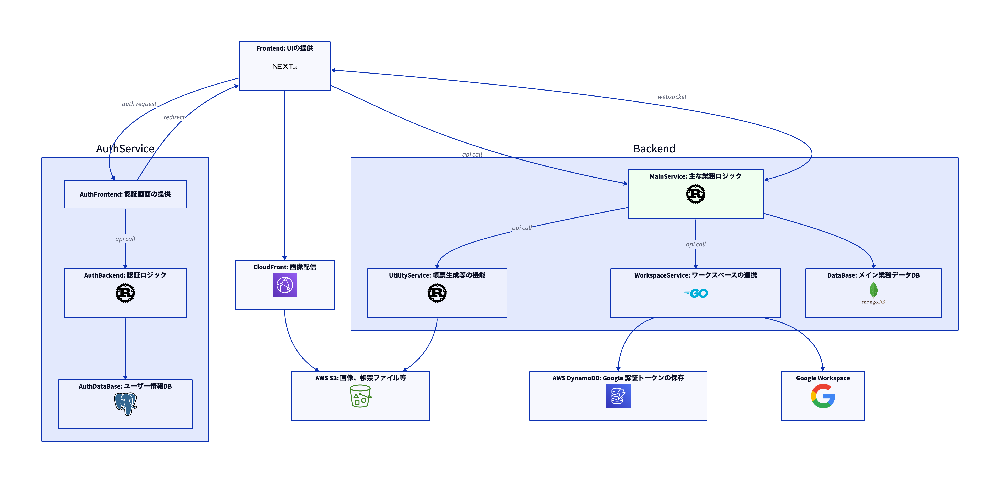

# OISM -- PH 店舗管理システム Backend

## システム概要

OSIM は EC ショップのバックオフィスに必要な機能をまとめて提供するサービスです。

### 主な機能

以下機能が含まれています

#### 注文管理

- 注文の受付
- 注文の状態管理

#### 在庫管理

- 入庫・出庫
- 履歴管理
- 倉庫間移動

#### 出荷管理

- 出荷の作成生
- 輸送ベンダー管理
- 輸送帳票生成

#### コラボレーション

- 複数ユーザ
- ユーザー間のリアルタイム情報更新

#### 外部連携

- Google Workspace への通知
- Google Workspace へのタスク割り当て

## システム構成

\*\* 図 Backend:MainService 部分が本プロジェクト



## Development

### Requirement

- メインデータベースの起動が必要。

- [just](https://github.com/casey/just)のインストールが必要

### Dev サーバー起動

```sh
just dev
```

### Test

```sh
just test-all
```

### 構造図生成

```sh
just generate-structure
```

### プロジェクトのコンフィグレーション

ローカル環境と本番環境の切り替えは`APP_ENVIRONMENT`環境変数で行う。

[config](https://github.com/mehcode/config-rs)を利用しており、利用法は[doc](https://docs.rs/config/latest/config/)参照
本プロジェクトのコンフィグレーションは階層構造を採用しており、
最優先：コンフィグレーション用環境変数
次優先：`configurations`フォルダー内の`toml`ファイル

具体的な設定内容は[ソースファイル](./src/configuration.rs)を参照してください

#### コンフィグレーション用環境変数

環境変数にプレフィックス`OISM`をつけることで、コンフィグレーション用環境変数として読み込みできる。

#### `configurations`フォルダー内の`toml`ファイル

`base.toml`が基本設定ファイルで、かならず読み込まれる。
`local.toml`はローカル環境用設定ファイルで、`base.toml`を上書きする。
`production.toml`は本番環境用設定ファイルで、`base.toml`を上書きする。
